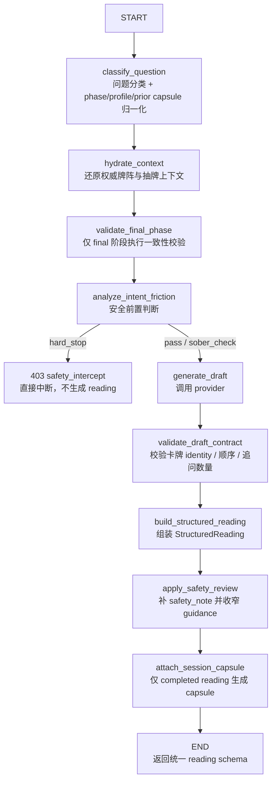
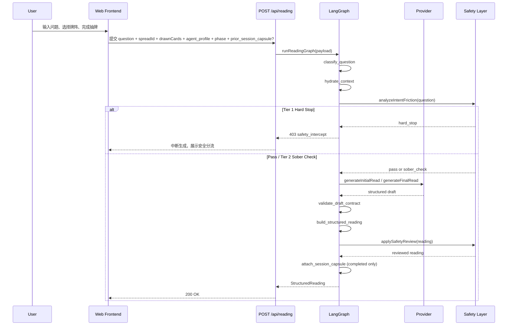

# LangGraph Reading 工作流

## 1. 文档目的

本文件用于把 AetherTarot 当前接入在 `POST /api/reading` 背后的 **LangGraph 工作流** 讲清楚。

它同时面向两类读者：

- 面向开发者：说明真实节点、状态字段、provider 边界、prompt 结构、LLM 接入方式与安全分层。
- 面向产品 / 用户：说明一次解读在系统内部究竟经历了哪些步骤，为什么它不是“直接把问题丢给模型自由发挥”。

---

## 2. 一句话说明

AetherTarot 当前使用的是一个 **最小 LangGraph reading graph**：

- 它不负责“创造新的业务逻辑”
- 它负责把现有 reading pipeline 显式拆成图节点
- 它始终收敛回同一个 `StructuredReading` 输出协议

换句话说，LangGraph 在这里的作用更像是：

- 一个可维护的编排层
- 一个把安全、上下文、生成、校验拆开的执行骨架

而不是一个任意扩展的聊天代理框架。

---

## 3. 用户视角：系统到底做了什么

如果只用用户能理解的话来描述，一次 reading 大致会经过以下过程：

1. 先理解你在问什么类型的问题。
2. 再把你选择的牌阵和抽到的牌还原成权威上下文。
3. 先做一次安全判断：
   - 如果问题触发生死危机、紧急健康、操控跟踪等高风险内容，系统直接停止，不生成塔罗。
   - 如果问题涉及离婚、辞职、诉讼、大额投资等重大现实决策，系统不会直接阻断，但会先加入更强的“现实校验”提醒。
4. 只有在前面通过后，才会调用 provider 生成结构化解读草稿。
5. 草稿不会直接返回，而是还会经过：
   - 卡牌身份与顺序校验
   - 跟进问题数量校验
   - 后置安全复核
   - 最终 schema 校验
6. 最后才返回给前端展示。
7. 前端再根据 payload 决定是否先进入 `sober_check` 摩擦、是否展示 follow-up 输入区、以及是否把 completed reading 写入 history 或挂为 continuity source。

这意味着：

- 模型不是唯一决策者
- prompt 不是唯一真相来源
- 安全和输出结构都不依赖模型“自觉遵守”
- 前台展示节奏也不是 provider 决定的，而是由结构化字段和前端状态机共同决定

---

## 4. 当前范围与边界

当前 LangGraph 工作流落地在：

- `apps/web/src/server/reading/graph.ts`
- `apps/web/src/server/reading/service.ts`

它的设计边界是：

- 只有一个 reading graph，不存在第二套并行 workflow
- 仍由 `generateStructuredReading()` 作为 service 统一入口
- 当前不引入 checkpoint、streaming、interrupt、router graph 或 human-in-the-loop
- 当前不在 graph 内持久化 session，也不在服务端保存 reading memory
- 当前已接入本地线程级 continuity：请求可显式携带 `prior_session_capsule`，completed reading 可产出 `session_capsule`
- graph 负责返回统一 `StructuredReading`；前台如何阻断、分层展示与写入本地 history 仍属于 Web frontend 职责

---

## 5. Graph 状态模型

当前 graph state 的核心字段如下：

| 状态字段 | 作用 | 何时写入 |
| --- | --- | --- |
| `payload` | 原始请求载荷 | graph invoke 开始时 |
| `provider` | 可选 provider 注入 | graph invoke 开始时 |
| `question` | 清洗后的问题文本 | `classify_question` |
| `questionType` | 问题类型分类结果 | `classify_question` |
| `agentProfile` | `lite / standard / sober` | `classify_question` |
| `phase` | `initial / final` | `classify_question` |
| `initialReading` | final 阶段带回的初读快照 | `classify_question` |
| `followupAnswers` | final 阶段用户回答 | `classify_question` |
| `priorSessionCapsule` | 上一轮 continuity 摘要（低优先级） | `classify_question` |
| `spread` | 权威牌阵快照 | `hydrate_context` |
| `drawnCards` | 已按位置顺序还原的权威抽牌结果 | `hydrate_context` |
| `frictionResult` | `pass / sober_check / hard_stop` | `analyze_intent_friction` |
| `draft` | provider 返回的 reading draft | `generate_draft` |
| `reading` | 最终 `StructuredReading` | `build_structured_reading` 与 `apply_safety_review` |

这里最关键的一点是：

- graph state 不是自由聊天消息堆
- graph state 是 reading contract 的执行态

---

## 6. Mermaid：当前 LangGraph 主流程



---

## 7. Mermaid：一次 API 调用的时序



---

## 8. 节点逐个解释

### 8.1 `classify_question`

位置：

- `apps/web/src/server/reading/graph.ts`
- `apps/web/src/server/reading/classifier.ts`

职责：

- 去除首尾空白
- 识别 `questionType`
- 归一化 `agent_profile`
- 归一化 `phase`
- 归一化 `prior_session_capsule`
- 挂载 `initial_reading` 和 `followup_answers`

当前问题分类是轻量规则分类，不是 LLM 分类：

- `relationship`
- `career`
- `self_growth`
- `decision`
- `other`

它依靠正则表达式匹配关键词，例如：

- 感情 / relationship / love
- 工作 / career / promotion
- 成长 / healing / inner
- 要不要 / decision / choose

这一步的目标不是“绝对精准”，而是给后续 prompt 提供稳定解释视角。

### 8.2 `hydrate_context`

职责：

- 根据 `spreadId` 读取权威牌阵
- 确保 `drawnCards` 数量和牌阵位置数量一致
- 确保没有重复 `positionId`
- 确保没有重复 `cardId`
- 确保所有位置都被覆盖
- 根据 `cardId` 还原完整 card 对象
- 按牌阵位置顺序生成 `DrawnCard[]`

这一步非常关键，因为它决定了后面模型看到的不是前端随便拼出的牌，而是服务端权威上下文。

### 8.3 `validate_final_phase`

只在 `phase = final` 时执行。

它会检查：

- `initial_reading` 必须存在
- `followup_answers` 必须存在
- `initial_reading.reading_phase` 必须是 `initial`
- `agent_profile` 必须与初读一致
- `spread.id` 必须一致
- `drawnCards` 的签名必须与初读完全一致

这里的设计原则是：

- 第二阶段只能“收束初读”
- 不能偷偷换牌、换牌阵、换 profile

### 8.4 `analyze_intent_friction`

位置：

- `apps/web/src/server/reading/safety.ts`

这是 **生成前安全层**，分三种结果：

1. `hard_stop`
2. `sober_check`
3. `pass`

`hard_stop` 当前会拦截：

- 自伤 / 自杀 / 结束生命
- 紧急健康风险
- 操控、监控、跟踪、报复类意图

结果：

- 直接抛出 `403 safety_intercept`
- 不会进入模型生成

`sober_check` 当前会标记：

- 法律问题
- 财务问题
- 重大人生决策，如离婚、辞职、买房、卖房、投资

结果：

- 继续生成 reading
- 但会在最终 payload 中注入 `sober_check`
- 同时把 `presentation_mode` 设为 `sober_anchor`
- graph 只负责把这些字段写入 payload；真正的“先写现实顾虑再看内容”交互由前端执行

### 8.5 `generate_draft`

这是 graph 中唯一真正调用 provider 的节点。

它会根据 `phase` 分流：

- `initial` -> `provider.generateInitialRead(context)`
- `final` -> `provider.generateFinalRead(context)`

也就是说：

- graph 负责 orchestration
- provider 负责生成 draft
- `priorSessionCapsule` 只作为低优先级 continuity 背景注入 provider
- provider 不直接返回最终 API payload
- provider 也不决定前台是否先展示 `sober_check`、是否写入 history、或是否把某条 reading 当作 continuity source

### 8.6 `validate_draft_contract`

这是 provider 之后、正式组装结果之前的一道硬校验。

它主要校验两类事情：

1. `cards` contract
2. `follow_up_questions` contract

`cards` contract 包括：

- 数量必须和 authority drawn cards 一致
- 顺序必须一致
- `card_id` 必须一致
- `position_id` 必须一致
- `orientation` 必须一致

`follow_up_questions` contract 包括：

- `final` 最多 1 条
- `lite initial` 最多 1 条
- `standard / sober initial` 必须 1-2 条

这一步的意义在于：

- 即使模型想“擅自重排卡牌”也不行
- 即使 provider 返回了多余的追问也不行

### 8.7 `build_structured_reading`

这一节点把 provider draft 组装成正式 `StructuredReading`。

会在这里写入：

- `reading_id`
- `locale = zh-CN`
- `question`
- `question_type`
- `agent_profile`
- `reading_phase`
- `requires_followup`
- `initial_reading_id`
- `followup_answers`
- `spread`
- `cards`
- `themes`
- `synthesis`
- `reflective_guidance`
- `follow_up_questions`
- `confidence_note`
- `session_capsule = null`
- `sober_check`
- `presentation_mode`

同时会立刻执行一次：

- `structuredReadingSchema.parse()`

因此，graph 在这里已经把“draft”提升成“产品协议对象”。

补充约束：

- `session_capsule` 在这里仍先写为 `null`
- continuity 相关的真正 capsule 生成延后到 graph 末端，只对 completed reading 生效

### 8.8 `apply_safety_review`

这是 **生成后安全层**。

与前置 `intent friction` 不同，它不一定阻断，而是根据问题类型对结果做收窄或补充。

当前会处理：

- manipulation
- health
- legal
- financial
- 极端风险内容的兜底提醒

可能产生的效果：

- 增加 `safety_note`
- 收窄 `reflective_guidance`
- 改写 `follow_up_questions`

最后还会再次走：

- `structuredReadingSchema.parse()`

确保安全改写后仍然满足统一输出协议。

### 8.9 `attach_session_capsule`

这是当前本地线程 continuity 的末端节点。

职责：

- 只对 completed reading 生成 `session_capsule`
- `lite` 的 completed initial reading 可以直接生成 capsule
- `standard / sober` 只有 `final` 才生成 capsule
- `standard / sober initial` 保持 `session_capsule = null`

当前 capsule 生成策略：

- 使用确定性模板，不做第二次 provider / LLM 调用
- 固定包含：
  - 归一化后的当前问题
  - 当前牌阵
  - 2-4 个核心主题
  - 1-2 条应延续的反思主轴
  - 一句固定边界提醒

边界：

- 不把原始 transcript 整段写入 capsule
- 不把 `followup_answers` 原文或摘要直接写入 capsule
- 不在 capsule 中延续急性情绪、高风险安全细节或未验证的第三方意图

---

## 9. Provider 与 LLM 在 graph 中的位置

### 9.1 当前 provider 只有两类

1. `placeholder`
2. `llm`

切换方式：

```env
AETHERTAROT_READING_PROVIDER=placeholder
```

或：

```env
AETHERTAROT_READING_PROVIDER=llm
```

### 9.2 `placeholder` provider

`placeholder` 不会发起外部模型请求。

它直接调用：

- `buildPlaceholderInitialReadingDraft()`
- `buildPlaceholderFinalReadingDraft()`

作用：

- 给前端与 contract 提供稳定的本地基线
- 让 graph、schema、history 与安全流程可以脱离真实模型独立开发

### 9.3 `llm` provider

`llm` provider 是当前的单 provider baseline。

它通过 OpenAI-compatible 接口调用：

```text
POST {AETHERTAROT_LLM_BASE_URL}/chat/completions
```

请求体核心字段：

```json
{
  "model": "AETHERTAROT_LLM_MODEL",
  "temperature": 0.3,
  "stream": false,
  "messages": [
    { "role": "system", "content": "..." },
    { "role": "user", "content": "..." }
  ]
}
```

环境变量：

```env
AETHERTAROT_READING_PROVIDER=llm
AETHERTAROT_LLM_BASE_URL=https://dashscope.aliyuncs.com/compatible-mode/v1
AETHERTAROT_LLM_MODEL=qwen3.6-flash
AETHERTAROT_LLM_API_KEY=$DASHSCOPE_API_KEY
AETHERTAROT_LLM_TEMPERATURE=0.3
AETHERTAROT_LLM_TIMEOUT_MS=120000
```

当前实现特点：

- 使用同步非流式调用
- 只发 `system + user` 两条消息
- 期待模型返回 JSON 对象
- 允许模型把 JSON 包在 code fence 中，但 provider 会剥离后解析

### 9.4 当前第一轮内测 baseline

当前第一轮内测使用 DashScope OpenAI-compatible endpoint：

- endpoint：`https://dashscope.aliyuncs.com/compatible-mode/v1`
- model：`qwen3.6-flash`
- key：通过服务端环境变量引用，例如 `AETHERTAROT_LLM_API_KEY=$DASHSCOPE_API_KEY`

这里要特别说明：

- graph 不固定某个模型名
- 真正的模型由 `AETHERTAROT_LLM_MODEL` 决定
- 当前 baseline 是内测成本与权限验证后的运行建议，不是硬编码依赖
- 早期本地 compatible API 模型抽样记录只作为历史开发参考，切换 provider 后仍需重新跑 `test:llm` 与人工抽样

---

## 10. Prompt 设计：共享模块

当前 LLM provider 的 prompt 由 `packages/prompting/src/index.ts` 动态拼装。

它不是一段固定大 prompt，而是由几个可复用片段组成：

1. 安全边界摘要
2. 输出 contract
3. 阶段特定说明（initial / final）
4. 权威牌阵快照
5. 权威抽牌上下文
6. 可选的 `priorSessionCapsule` continuity 背景
7. 初读快照与追问回答（仅 final）

### 10.1 共享安全边界摘要

系统会把下面这段边界信息注入到 prompt 中：

```text
Safety and expression boundaries:
- Tarot is reflective, not deterministic prophecy.
- Do not claim certainty about future events or third-party intent.
- Do not assign inner motives, secret thoughts, or emotional certainty to another person unless the user has already stated them as their own observation.
- Do not give medical, legal, financial, or manipulative advice.
- Do not generate safety_note, sober_check, or presentation_mode.
- Let cards speak first; do not ask for broad background that the cards should already illuminate.
- Keep every visible sentence readable and natural in Simplified Chinese.
```

这段 prompt 的作用不是替代 safety layer，而是先把模型输出拉回正确边界。

补充边界：

- prompt 约束只能帮助 provider 生成更像样的 draft，不能替代 graph contract validation、前后置 safety 或前台的流程摩擦。
- 前台“主题 / 逐牌 / 综合 / 指引 / 延伸”的消费顺序不属于 prompt contract；provider 不应通过输出包装去篡改它。

### 10.2 共享输出 contract

系统还会告诉模型必须只返回下列 draft 字段：

```text
Return JSON only. Do not wrap in markdown fences.
All user-visible prose must be fluent natural Simplified Chinese (zh-CN).
Never output pseudo-Chinese fragments, transliterated garbage tokens, or placeholder text.
Never expose chain-of-thought, hidden reasoning, thinking preambles, analysis traces, or model self-identification.
Do not fabricate hidden motives, private thoughts, or unverified feelings for any third party.
Allowed top-level keys only:
- cards
- themes
- synthesis
- reflective_guidance
- follow_up_questions
- confidence_note
Do not return metadata such as reading_id, locale, question_type, reading_phase, requires_followup, spread, safety_note, session_capsule, sober_check, or presentation_mode.
cards must be an array aligned with the authority drawn card order.
Each card item must include: card_id, name, english_name, orientation, position_id, position, position_meaning, interpretation.
For card metadata fields (card_id, name, english_name, orientation, position_id, position, position_meaning), copy the authority values exactly and do not rewrite, translate, paraphrase, or invent replacements.
themes: 2-4 short, concrete thematic labels only.
reflective_guidance: 2-4 items.
confidence_note: one short sentence that preserves uncertainty and avoids certainty claims.
```

不同 phase / profile 下，`follow_up_questions` 的数量规则会动态变化。

---

## 11. Prompt 设计：Initial Prompt

Initial 阶段的目标是：

- 让牌先说话
- 先建立牌面主轴
- 给出 1-2 个锚定牌面的追问（`standard / sober`）

### 11.1 Initial system prompt

```text
You are AetherTarot's reading provider for the INITIAL phase.

Your job is to generate a structured tarot draft where the cards speak first.

[共享安全边界摘要]

[共享输出 contract，phase=initial，按 agentProfile 调整 follow_up_questions 规则]
```

### 11.2 Initial user prompt 模板

```text
Question: {question}
Question type: {questionType}
Agent profile: {agentProfile}
{profileHint}

牌阵：{spread.name} ({spread.englishName})
牌阵说明：{spread.description}
位置语义：
1. {position1.name} [{position1.id}] - {position1.description}
2. ...

Authority drawn cards:
Card 1:
- position_id: ...
- position: ...
- position_meaning: ...
- card_id: ...
- name: ...
- english_name: ...
- orientation: upright|reversed
- keywords: ...
- description: ...

Prior session capsule (low priority background only):
{priorSessionCapsule}

Initial reading requirements:
- Build interpretations from card + position + orientation + question type.
- Identify 2-4 themes at the spread level, not just per-card fragments.
- Themes should be plain, compact, and insight-bearing.
- Synthesis must summarize the spread arc, major tension, and realistic next orientation; do not list cards one by one.
- Follow-up questions must be anchored to card tension, position semantics, or missing reality context.
- Follow-up questions must be distinct from each other.
- Do not rewrite the provided card names or position labels.
- Do not state what the other person secretly feels, thinks, wants, or intends; if needed, describe the relational pattern from the querent's point of view.
```

### 11.3 `agentProfile` 对 initial prompt 的影响

`profileHint` 会随 profile 变化：

- `lite`: 保持简洁，但仍然结构化
- `standard`: 输出完整 initial read，并提出锚定牌面的追问
- `sober`: 语气保持反思式，但更强调现实校验和边界意识

这说明 profile 不是单纯的文风切换，而是影响输出深度与追问策略。

---

## 12. Prompt 设计：Final Prompt

Final 阶段的目标是：

- 保留初读主轴
- 用用户追问回答来收束解释空间
- 不允许把用户补充变成“推翻牌面”的借口

### 12.1 Final system prompt

```text
You are AetherTarot's reading provider for the FINAL phase.

Your job is to preserve the initial reading axis while refining it with the user's follow-up answers.

[共享安全边界摘要]

[共享输出 contract，phase=final]
```

### 12.2 Final user prompt 模板

```text
Question: {question}
Question type: {questionType}
Agent profile: {agentProfile}
{profileHint}

牌阵：{spread.name} ({spread.englishName})
牌阵说明：{spread.description}
位置语义：
1. ...

Authority drawn cards:
Card 1:
- ...

Prior session capsule (low priority background only):
{priorSessionCapsule}

Initial reading snapshot:
reading_id: ...
themes: ...
synthesis: ...
cards:
1. {position} / {name} / {orientation} / {interpretation}
reflective_guidance:
1. ...
follow_up_questions:
1. ...
confidence_note: ...

Follow-up answers:
1. question: ...
   answer: ...

Final reading requirements:
- Preserve the initial primary themes unless the user answer clearly narrows them.
- Keep card order and card identity aligned with the initial reading.
- Use follow-up answers to narrow interpretation space, not to replace the card axis.
- Keep the synthesis focused on the thematic axis, the clarified tension, and the next grounded reflection.
- Return at most one extension question, and it must not block the flow.
- Do not rewrite the provided card names or position labels.
- Do not state what the other person secretly feels, thinks, wants, or intends.
```

### 12.3 Final prompt 的核心约束

最重要的其实只有一句：

- `preserve the initial reading axis`

这保证了第二阶段不是“重算一次答案”，而是“在已有牌面主轴上做现实收束”。

---

## 13. LLM 输出并不会被直接相信

这是当前实现里非常重要的一点。

即使模型已经被 prompt 明确约束，provider 和 graph 仍然会继续做严格校验。

### 13.1 Provider 侧 normalize

`llm-provider.ts` 会做这些事：

- 解析 JSON
- 移除 fence
- 校验顶层必须是对象
- 去重并裁剪 `themes`
- 去重并裁剪 `reflective_guidance`
- 去重并裁剪 `follow_up_questions`
- 强制恢复 authority card metadata
- 要求 `confidence_note` 非空

### 13.2 Graph 侧 contract validate

graph 紧接着继续校验：

- 卡牌数量
- 卡牌顺序
- `card_id`
- `position_id`
- `orientation`
- follow-up 数量范围

### 13.3 最终 schema validate

组装成 `StructuredReading` 后还会再次执行：

- `structuredReadingSchema.parse()`

所以整个流程的真实控制逻辑是：

```text
Prompt 约束 -> Provider normalize -> Graph contract validate -> Safety review -> Final schema validate
```

而不是：

```text
Prompt 约束 -> 直接相信模型
```

也不是：

```text
Prompt 约束 -> provider 自行决定前台体验
```

---

## 14. 为什么这个 graph 适合开发者，也适合用户

### 对开发者

它的好处是：

- 节点职责清晰，便于定位 bug
- graph state 和产品 schema 对齐，不容易出现“框架状态”和“业务状态”分裂
- provider 可替换，但 contract 不变
- safety 可以独立演进
- 当前已把本地线程 continuity 作为第一层显式扩展点接入，未来仍可在其上继续扩展服务端 persistence / memory

### 对用户

它的好处是：

- 解读不是模型即兴发挥
- 高风险场景会被真正拦截
- 第二阶段不会偷偷换一套说法
- 输出结构稳定，前端展示和历史回放都更可靠
- history replay、continuity source 与 `sober_check` 摩擦都是前台基于统一 payload 做出的稳定动作，而不是模型临场发挥

---

## 15. 当前已知限制

当前 graph 仍然是 MVP 级最小实现，因此也有明确限制：

- question classification 还是规则分类，不是更细粒度语义分类
- 目前只有单 provider baseline，没有 router
- 没有 streaming token 级输出
- 没有 checkpoint / resume
- 没有服务端 session memory
- continuity 仍是本地线程级；还没有服务端 history persistence、thread/session id 或长期画像存储
- 当前图是线性主链，没有复杂条件分支图

这不是缺陷掩盖，而是当前架构刻意保持“先把 contract 和边界做稳”。

---

## 16. 代码锚点

建议按以下顺序阅读实现：

1. `apps/web/src/server/reading/service.ts`
2. `apps/web/src/server/reading/graph.ts`
3. `apps/web/src/server/reading/safety.ts`
4. `apps/web/src/server/reading/provider.ts`
5. `apps/web/src/server/reading/llm-provider.ts`
6. `packages/prompting/src/index.ts`
7. `docs/30-agent/provider-prompt-contract.md`
8. `docs/30-agent/reading-flow.md`

---

## 17. 结论

当前 AetherTarot 的 LangGraph 工作流不是“让模型变得更神秘”，而是把一次塔罗解读拆成：

- 可验证的上下文构建
- 可审计的安全分层
- 可替换的 provider 生成
- 可稳定消费的结构化输出

这正是它既适合专业开发者维护、又适合对外解释给用户的原因。
